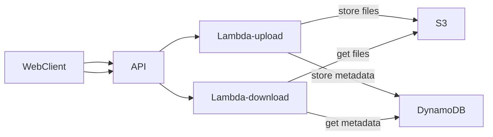

# photup

画像アップロード・取得アプリ
[Geminiからの要件](REQUIREMENTS.md)

## 要件整理・メモ

アーキテクチャ図

- 画像アップロード
  - バイナリデータの送受信 <https://developer.mozilla.org/ja/docs/Web/API/XMLHttpRequest_API/Sending_and_Receiving_Binary_Data>
  - UUID <https://developer.mozilla.org/en-US/docs/Web/API/Crypto/randomUUI>
  - ファイル名と保存先S3キーをDynamoDBに保存
  - メタデータを送る場合バイナリをbase64エンコードしたうえでjsonでPOSTするのが速そう。multipart form dataはパースが複雑層なので断念。
- 画像一覧取得
  - ファイル名と一緒にS3キーをリストするのは意味がない上にセキュリティを損なうので却下し、「ファイル名一覧を返す」に仕様変更する
- 画像取得
  - ファイル名の指定はクエリ文字列で渡す
  - バイナリデータを返す
- 認証
  - API Gateway APIキー
    - <https://docs.aws.amazon.com/ja_jp/serverless-application-model/latest/developerguide/serverless-controlling-access-to-apis-keys.html>
    - <https://docs.aws.amazon.com/ja_jp/apigateway/latest/developerguide/api-key-usage-plan-cfn.html>
    - <https://qiita.com/cony0413/items/e7f56d45cf28476162ec>
- ステップアップ
  - Cognito User Poolsを使った認証 (Security)
  - S3 Presigned URLを使った配信でAPIの負荷を低減する (Reliability, Cost optimization)
  - ファイル名が重複しそうなのでリソース管理に名前空間が必要 (Security, Reliability)
    - API Key, User ID, ...
  - 画像データのバリデーション (Security)
    - 拡張子チェック

分類はAWS Well-Arhitected Frameworkより  
<https://docs.aws.amazon.com/wellarchitected/latest/framework/the-pillars-of-the-framework.html>
